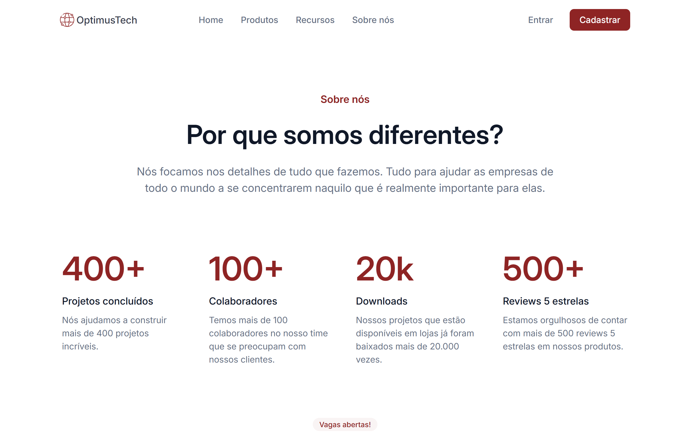

# Projeto do Desafio 7 Days of Code durante curso de mobile-first na Alura.

## Ferramentas utilizadas (até o momento):

* HTML

* CSS

* FLEXBOX

## Descrição

Projeto desenvolvido durante o desafio 7 Days of Code buscando a pratica do uso das linguagens HTML e CSS.

## Feito por:

### MNynee (Matheus Faustino)

#7DaysOfCode